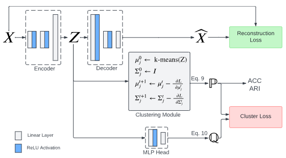

## Deep Clustering of Tabular Data by Weighted Gaussian Distribution Learning


More details on arXiv: [https://arxiv.org/abs/2301.00802](https://arxiv.org/abs/2301.00802)
## Requirements
We recommend users set up a Conda Environment using the env.yml file

## Notes
Consider tuning the following two hyperparameters below : 
* Stop factor (--stop_w_factor) can be data set dependent, so we recommend using a default value,  --stop_w_factor = 0.1.
* Embedding size (--latent_dim) can also be data set dependent, so we recommend using embedding size, --latent_dim = X.shape[1].

gceals_ensemble.py considered GCEALS performance of multiple latent dimensions. Please check details in [https://arxiv.org/abs/2604.07085](https://arxiv.org/abs/2604.07085).

## Run Command
Use the following comment to run the G-CEALS with latent dimension ensemble:  

```bash
python gceals_ensemble.py --device cuda:0 --pretrain_epochs 1000 --finetune_epochs 1000 --l_rate 0.001 --gamma 0.1 --name gceals_default --dataset 1510 --latent_dim 10 --save_file_name 1510_ensemble
```

Use the following format to run the G-CEALS model:  

```bash
python gceals.py --device cuda:0 --pretrain_epochs 1000 --finetune_epochs 1000 --l_rate 0.001 --gamma 0.1 --name gceals_default --dataset 1510 --latent_dim 10
```

## Citation
Please cite this paper

Rabbani, S. B., Medri, I. v., & Samad, M. D. (2025). Deep clustering of tabular data by weighted Gaussian distribution learning. Neurocomputing, 623, 129359. https://doi.org/10.1016/j.neucom.2025.129359

Please cite the paper with the ensemble framework. The paper has been accepted to the IEEE International Conference on Healthcare Informatics (ICHI 2026).

Samad, M. D., Hou, Y., & Ghosh, S. (2026). Mining Electronic Health Records to Investigate Effectiveness of Ensemble Deep Clustering. arXiv preprint arXiv:2604.07085.
